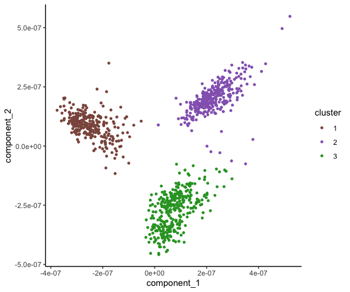
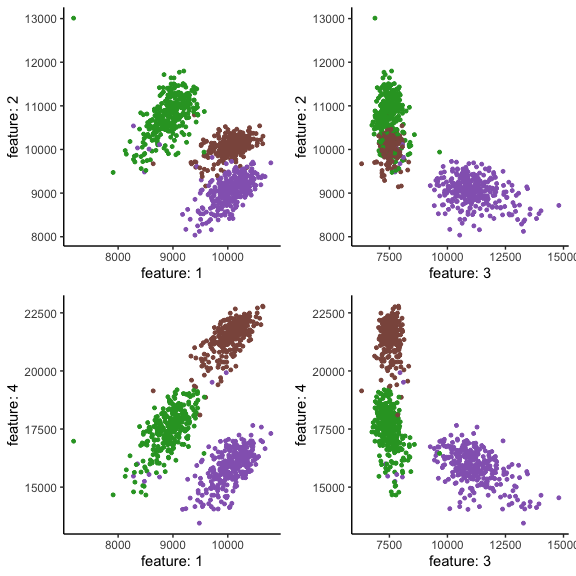
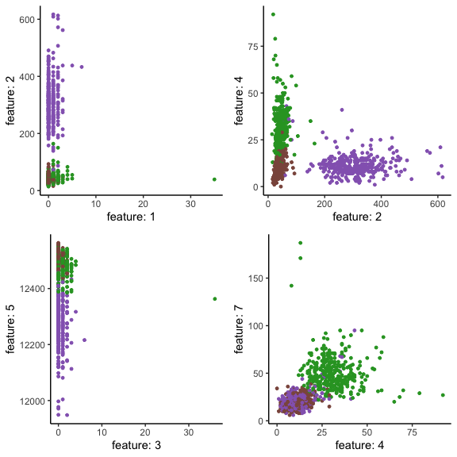
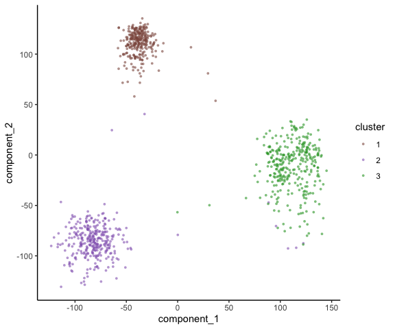
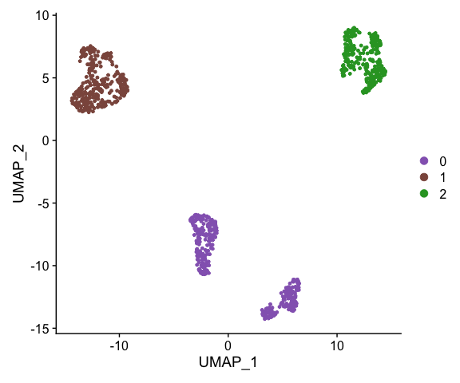

countland: rank reduction and data visualization
================

### Samuel H. Church

``` r
library(countland)
library(Seurat)
#> Attaching SeuratObject
#> Attaching sp
library(ggplot2)
theme_set(theme_classic())
```

This vignette demonstrates several methods for approximating a lower
rank version of the count matrix, and for visualizing the count matrix
in a reduced dimensional space.

Here we implement the `countland` clustering workflow on the Gold
Standard dataset from [Freytag *et al*
(2018)](10.12688/f1000research.15809.2).

``` r
gold.data <- Seurat::Read10X(data.dir = "../data/Gold_Freytag2018/")
set.seed(84095)

C <- countland(gold.data)
#> [1] "countland object"
#> [1] "after removing empty cells and genes,"
#> [1] "the count matrix has 29212 genes (rows)"
#> [1] "    and 925 cells (columns)"
#> [1] "the fraction of entries that are nonzero is 0.2905"
C <- Dot(C)
#> [1] "Calculating dot products between rows..."
#> [1] "    done."
C <- Embed(C)
#> [1] "Performing spectral embedding on dot products..."
#> [1] "    done."
C <- Cluster(C,n_clusters=3)
#> [1] "Performing spectral clustering on dot products..."
#> [1] "    done."
```

## Spectral embedding

The default method in `countland` for visualizing cell-cell similarity
is spectral embedding of the dot product matrix.

``` r
PlotEmbedding(C)
```

<!-- -->

## Other methods of dimensional reduction

Rank reduction is a significant challenge with single-cell data, in
large part because highly sparse data are highly difficult to reduce
without discarding features entirely.

`countland` implements two forms of count-based rank reduction:

### Integer matrix approximation

Integer matrix factorization, described
[here](https://mtchu.math.ncsu.edu/Research/Papers/bindec05f.pdf), is an
approach to achieve a low-rank approximation of matrices that include
only natural numbers. Like other matrix factorizations
(e.g. singular-value decomposition), this method seeks to find
lower-rank matrices that can be multiplied together to approximate a
higher-rank matrix, here the count matrix.

Integer matrix approximation generates three matrices, termed
,
,
and
.
When using integer matrix approximation on single-cell count data,
matrix

has the dimensions

cells by

features, with

provided as the target rank,

has the dimensions

features by

genes, and

is a diagonal matrix of

scaling factors.

Because of the discrete nature of count data, this factorization cannot
be accomplished conventionally, but [approximations for this
factorization](https://github.com/kperros/SUSTain) have been proposed
for other types of count-based data. Here we implement the algorithm for
integer matrix approximation in python and R, and apply it to the
approximation of single-cell count data. The bounds of the integer
values in each matrix can be changed to accomodate the data in question.

With IMA, we subsample cells because we don’t want heterogeneity in
sequencing depth to impact the factorization. We have also subsampled
genes to a maximum expression value, here set at the number of cells
times 10. This prevents the factorization from reflecting only a few
highly expressed genes.

We can first identify a reasonable target rank by visualizing how many
dimensions are required to best approximate the count matrix.

**Note that this takes some time (\~4 mins)**

``` r
C <- Subsample(C,gene_counts=ncol(C@counts)*10,cell_counts="min")
#> [1] "subsampling 1592 genes to a max total counts of 9250"
#> [1] "subsampling all cells to a standard sequencing depth of 14731"
PlotIMAElbow(C,max_features=20,u_bounds=c(5,10),subsample=TRUE)
```

<!-- -->

Based on the elbow plot above, the approximation does not appear to
improve by adding features beyond \~15.

``` r
set.seed(84095)
I <- RunIMA(C,features=15,u_bounds=c(5,10),subsample=TRUE)
```

We can visualize cells by embedding counts (matrix
)
in this reduced space. This is calculated with matrix multiplication
").
Components in this space are unordered, so it can be helpful to view
cells embedded in several combinations of components.

``` r
i1 <- PlotIMA(I,x=1,y=2,subsample=TRUE)
i2 <- PlotIMA(I,x=3,y=2,subsample=TRUE)
i3 <- PlotIMA(I,x=1,y=4,subsample=TRUE)
i4 <- PlotIMA(I,x=3,y=4,subsample=TRUE)
gridExtra::grid.arrange(i1,i2,i3,i4,ncol=2)
```

<!-- -->

### Shared counts reduction

Another method for reducing the dimensions is to collapse groups of
genes with similar patterns of counts across cells. Here we can
accomplish this by calculating the number of shared counts between all
pairs of genes, identifying clusters of genes with similar counts, and
then summing counts within clusters.

**Note: this can be very slow on large datasets**

Because calculating pairwise shared count values is memory intensive,
this is performed using a random sample of cells, `n_cells`
(default=`100`). It may be also be necessary to subset to a group of
genes, say a sample of 10,000.

Here we subsample cells to a standard sequencing depth because we want
shared count values to reflect biological variation and not
heterogeneity in depth. We haven’t subsampled genes to a maximum
expression, however, and the consequence of this is that highly
expressed genes will have a large impact on the values of the summed
meta-genes. This is helpful for separating cell populations in the
visualization, but may result in some genes haven’t an outsized impact.
Choosing the correct subsampling procedure, if any, will depend on
research objectives.

``` r
set.seed(84095)
S <- SubsetGenes(C,sample(seq_len(nrow(C@counts)),10000))
#> [1] "after subsetting and removing empty cells and genes,"
#> [1] "after removing empty cells and genes,"
#> [1] "new number of genes: 10000"
#> [1] "new number of cells: 925"
S <- Subsample(S,cell_counts="min")
#> [1] "subsampling all cells to a standard sequencing depth of 12643"
S <- SharedCounts(S,n_clusters=10,subsample=TRUE)
```

Because the components of this dimensional reduction are groups of
genes, it can be helpful to view several combinations to assess which
capture a substantial amount of cell-cell variation.

``` r
s1 <- PlotSharedCounts(S,x = 1, y = 2)
s2 <- PlotSharedCounts(S,x = 2, y = 4)
s3 <- PlotSharedCounts(S,x = 3, y = 5)
s4 <- PlotSharedCounts(S,x = 4, y = 7)
gridExtra::grid.arrange(s1,s2,s3,s4,ncol=2)
```

<!-- -->

## Other visualization methods

### GLM-PCA

An alternative approach for comparing cells using untransformed counts
is generalized linear model based PCA, or GLM-PCA. This has been
described for scRNA-seq data
[here](https://doi.org/10.1186/s13059-019-1861-6) and implemented
[here](https://github.com/willtownes/glmpca-py).

**Note: this can also take some time.**

``` r
#install.packages("glmpca")
library(glmpca)
res <- glmpca(as(C@counts,"matrix"),2)
```

``` r
color_palette <- c("#8c564b", "#9467bd", "#2ca02c", "#e377c2", "#d62728", "#17becf", "#bcbd22", "#ff7f0e", "#7f7f7f", "#1f77b4")

factors <- res$factors
glmpca_df <- data.frame("component_1" = factors[,1],"component_2"=factors[,2],"cluster"=C@cluster_labels)
    ggplot(glmpca_df,aes(x = component_1,y = component_2, color=as.character(cluster))) +
  geom_point(size=1,alpha=0.6,pch=16) +
  guides(color=guide_legend(title="cluster")) +
  scale_color_manual(values=color_palette)
```

<!-- -->

### `Seurat`: UMAP

Here we compare the standard dimensional reduction workflow in `Seurat`
on the same data.

``` r
gold <- CreateSeuratObject(counts = gold.data, project = "pbmc3k", min.cells = 1, min.features = 1)
gold <- FindVariableFeatures(gold, selection.method = "vst", nfeatures = 2000)
gold <- NormalizeData(gold)
all.genes <- rownames(gold)
gold <- ScaleData(gold, features = all.genes)
#> Centering and scaling data matrix
gold <- RunPCA(gold, features = VariableFeatures(object = gold),verbose=F)
gold <- FindNeighbors(gold, dims = 1:10)
#> Computing nearest neighbor graph
#> Computing SNN
gold <- FindClusters(gold, resolution = 0.01)
#> Modularity Optimizer version 1.3.0 by Ludo Waltman and Nees Jan van Eck
#> 
#> Number of nodes: 925
#> Number of edges: 26790
#> 
#> Running Louvain algorithm...
#> Maximum modularity in 10 random starts: 0.9965
#> Number of communities: 3
#> Elapsed time: 0 seconds
gold <- RunUMAP(gold, dims = 1:10)
#> Warning: The default method for RunUMAP has changed from calling Python UMAP via reticulate to the R-native UWOT using the cosine metric
#> To use Python UMAP via reticulate, set umap.method to 'umap-learn' and metric to 'correlation'
#> This message will be shown once per session
#> 07:56:14 UMAP embedding parameters a = 0.9922 b = 1.112
#> 07:56:14 Read 925 rows and found 10 numeric columns
#> 07:56:14 Using Annoy for neighbor search, n_neighbors = 30
#> 07:56:14 Building Annoy index with metric = cosine, n_trees = 50
#> 0%   10   20   30   40   50   60   70   80   90   100%
#> [----|----|----|----|----|----|----|----|----|----|
#> **************************************************|
#> 07:56:14 Writing NN index file to temp file /var/folders/tq/3qjvbb7j0_vg8ksxzrsmwlk80000gn/T//RtmpQTx6TX/file65be113305a3
#> 07:56:14 Searching Annoy index using 1 thread, search_k = 3000
#> 07:56:14 Annoy recall = 100%
#> 07:56:15 Commencing smooth kNN distance calibration using 1 thread
#> 07:56:15 Found 2 connected components, falling back to 'spca' initialization with init_sdev = 1
#> 07:56:15 Initializing from PCA
#> 07:56:15 Using 'irlba' for PCA
#> 07:56:15 PCA: 2 components explained 66.99% variance
#> 07:56:15 Commencing optimization for 500 epochs, with 33948 positive edges
#> 07:56:17 Optimization finished
```

``` r
DimPlot(gold,reduction="umap",cols=c("#9467bd","#8c564b","#2ca02c"))
```

<!-- -->
